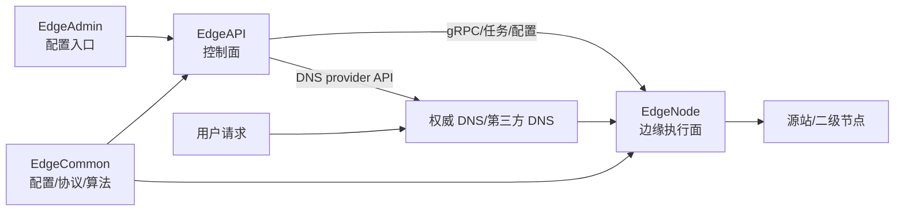

# GoEdge 调度方向学习工作区

这个目录用于把 GoEdge 的开源源码当作 CDN 调度学习材料来读。当前工作区已经包含三个联读仓库：

- `EdgeCommon`：共享配置、gRPC proto、调度算法、DNS/节点配置结构。
- `EdgeAPI`：控制面 API、数据库模型、后台任务、DNS 同步、健康检查。
- `EdgeNode`：边缘节点执行面、监听器、请求处理、反向代理、缓存和源站状态。

建议从这几份资料开始：

1. [learning-roadmap.md](learning-roadmap.md)：6 周学习路线和每周验收目标。
2. [code-reading-checklist.md](code-reading-checklist.md)：按链路组织的代码阅读清单。
3. [edgeone-overseas-dispatch-map.md](edgeone-overseas-dispatch-map.md)：把 GoEdge 机制映射到 EdgeOne 海外调度关注点。
4. [weekly-note-template.md](weekly-note-template.md)：每周代码笔记模板。

## 主链路

## 阅读原则

- 先看数据模型和配置结构，再看任务执行和请求链路。
- 先按“正常路径”读通，再补失败重试、自动下线、恢复、告警。
- 开源版缺少部分 Plus/闭源调度能力：`Node.HasScheduleSettings()` 返回 `false`，`EdgeNode/internal/nodes/http_request_ln.go` 在 `!plus` 构建下是 stub。把它们作为识别调度边界的线索，不要误认为完整的海外 GSLB 实现。
- 每周至少产出一张链路图、一页代码笔记、一个和 EdgeOne 海外调度相关的对照点。
