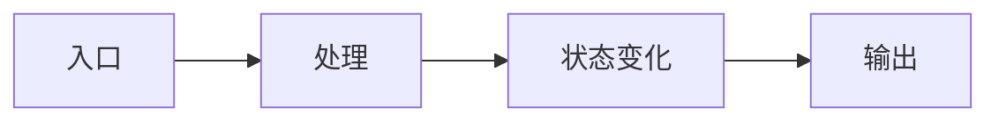

# GoEdge 调度学习周记模板

复制这份模板到自己的笔记里，每周填一次。

## Week N：主题

日期：

本周目标：

## 代码阅读范围

- 仓库：
- 文件：
- 入口函数：
- 相关测试：

## 主链路图

## 关键类型

| 类型/接口 | 文件 | 作用 | 关键字段/方法 |
| --- | --- | --- | --- |
|  |  |  |  |

## 调用链

1. 
2. 
3. 

## 状态变化

| 状态对象 | 触发条件 | 写入位置 | 后续影响 |
| --- | --- | --- | --- |
|  |  |  |  |

## 失败路径

- 失败条件：
- 重试策略：
- 降级/摘除：
- 恢复路径：
- 告警/日志：

## Go 语言点

- 本周看到的语言特性：
- 还不熟的语法或库：
- 值得模仿的代码写法：
- 需要避免的写法：

## EdgeOne 海外调度对照

- GoEdge 机制：
- 对应海外调度概念：
- GoEdge 开源版缺口：
- 我需要补充学习的真实业务知识：

## 本周问题

1. 
2. 
3. 

## 下周计划

- 
